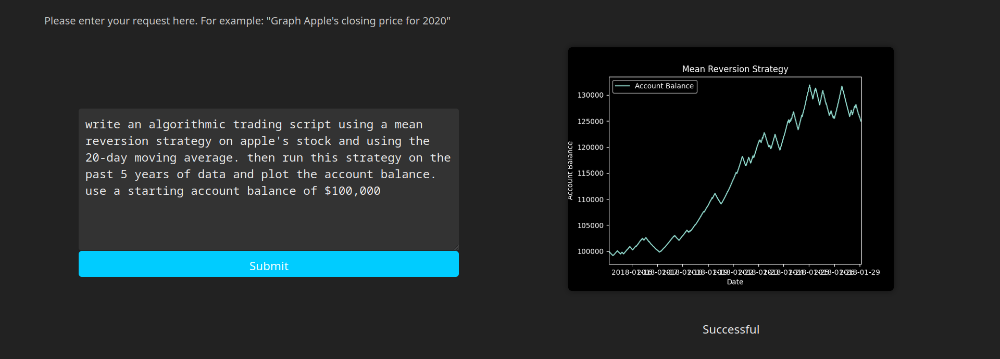
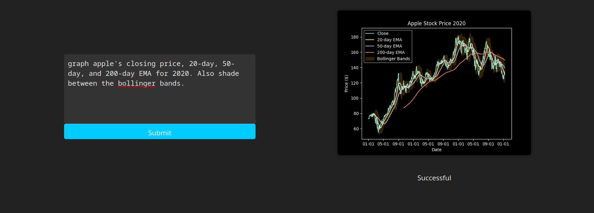
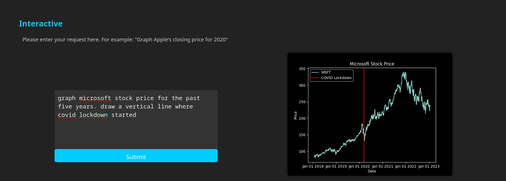

# plaiground

## Try it out [online!](https://jew256.github.io/plaiground/)

## How to run locally
- Download the source code
- Create an API key with OpenAI
- Create and assign environment variable `OPENAI_API_KEY` to your new key
- Run `pip install -r requirements.txt`
- Run `server.py` to start the flask backend
- In a seperate terminal, navigate to `code-generator/`
- Run `npm install`
- Run `npm run start` to start the application

## Some examples

